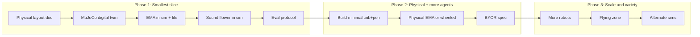

# SEA Kindergarten: Environment, Digital Twin, and Research Roadmap

## Vision (from README + EMA)

- **Goal**: A kindergarten of robots that continually learn by *living* in a shared physical (and virtual) environment, supporting research on **continual learning for continual living (and creating)**.
- **Alberta Plan alignment**: Real-world testbed for temporal uniformity, sensorimotor abstraction, auto-curriculum, and the "big world" problem—agents with imperfect information adapting in a changing, open environment.
- **Constraint**: Start small with the **simplest non-trivial setup**, then expand.

---

## 1. Physical Environment Design

**Concept**: Indoor, workshop-cum-playground, open to foot traffic (humans and robots in and out).

- **Layout**: Single room or clearly bounded zone with:
  - **Crib** (EMA's "bottom"): wireless charging pad, contained; first stage of auto-curriculum.
  - **Step up** from crib → **play pen** (terraced or raised area).
  - **Play pen** → **play yard** at main floor level.
  - **Open floor** for wheeled/treaded and legged robots, plus space for flying zone (net or ceiling height limits).
  - **Stationary "anchor" spots** for sound flower(s) and fixed charging/ docking.
  - **Shared utilities**: wireless charging zones, optional mobile trashcans, charging for bring-your-own-robot (BYOR) days.
- **Openness**: Clear ingress/egress for people and robots; no full enclosure so the world is "big" (unpredictable visitors, variable traffic).
- **Telemetry**: Power, pose, and sensor feeds; optional remote control for experiments and demos.

This gives one concrete **reference layout** (dimensions, zones, materials) that can be documented and later replicated or varied.

---

## 2. Digital Twin

- **Role**: Same logical environment (crib → play pen → play yard → open floor) in simulation for:
  - Algorithm development and debugging.
  - Reproducible evaluations.
  - Scaling (many parallel runs, variations) before deploying to hardware.
- **Requirements**:
  - **Geometry**: Match the physical layout (levels, step, charging zones, obstacles).
  - **Physics**: Support the first robot types (e.g. MuJoCo for EMA, then extensions).
  - **Life / rewards**: Model "survival" (e.g. battery/energy, charging at pad); optional models of "creating" (e.g. objects to manipulate or zones to maintain).
- **Scope for "start small"**: One simulation stack (e.g. MuJoCo) and one canonical scene file (or small set) that mirrors the minimal physical build.

---

## 3. Robot Taxonomy and "Start Small"

| Category                | Examples                            | Complexity                     | Role in "start small"                                                                      |
| ----------------------- | ----------------------------------- | ------------------------------ | ------------------------------------------------------------------------------------------ |
| **Legged**              | EMA (MuJoCo ant), then physical ant | Medium (sim) / High (physical) | **First agent**: EMA in sim + optional physical.                                           |
| **Stationary rotating** | Sound flower                        | Low                            | **First "environment" agent**: fixed sensor/actuator, good for multi-agent and curriculum. |
| **Wheeled/treaded**     | Mobile base, trashcan               | Low–Medium                     | Add after EMA + flower; enables navigation and fetch.                                      |
| **Quadruped**           | Unitree-style dog                   | High                           | Phase 2; same space, harder control.                                                       |
| **Humanoid**            | —                                   | Very high                      | Later; BYOR or dedicated platform.                                                         |
| **Flying**              | Small drone, micro (e.g. dragonfly) | Medium–High                    | Phase 2; need safety and airspace.                                                         |
| **BYOR**                | Any                                 | Variable                       | Events; define interface (API, charging, safety) once environment is stable.               |

**Simplest non-trivial setup (recommended first slice)**:

1. **One legged agent**: EMA (MuJoCo ant in sim; physical ant if/when ready).
2. **One stationary "environment" agent**: Sound flower (rotate, sense, possibly simple actuation).
3. **One physical environment**: Crib + step + play pen + play yard (minimal footprint).
4. **One digital twin**: Same layout in MuJoCo (or chosen sim), with charging and life model.

**Why this is non-trivial**: Two agent types, shared space, "life" (charging), and auto-curriculum (crib → pen → yard). It already stresses continual learning, temporal uniformity, and abstraction without requiring wheels, flight, or humanoids.

---

## 4. Simulation Environments

- **Primary (start small)**: **MuJoCo**. Already implied by EMA; good for contact-rich legged control and sensorimotor abstraction; supports custom XML for kindergarten layout and charging zones.
- **Extensions later**:
  - **Isaac Sim / NVIDIA**: If you add many robots or need high-fidelity sensors and GPU-heavy world models.
  - **Gazebo / Ignition**: If you standardize on ROS and want more heterogeneous robot models.
  - **Lightweight 2D**: For quick curriculum or coordination experiments (e.g. foraging, charging) before 3D.
- **Recommendation**: Lock **MuJoCo** as the first-class sim for the kindergarten digital twin and EMA; document the scene format and life model so other sims can be added as "alternate twins" later.

---

## 5. Variations and Combinations

- **Environment**: Crib size, step height, play pen area, number of charging pads; with/without obstacles, mobile trashcans, or sound flowers.
- **Agents**: EMA only → EMA + sound flower → + wheeled → + quadruped → + flying; same or different algorithms (e.g. Alberta Plan components) per agent type.
- **Life model**: Battery drain rate, charging rate at pad, reward for "survival" and optionally for "creating" or completing tasks.
- **Curriculum**: Fixed sequence (crib → pen → yard) vs. open-ended; human or robot foot traffic as disturbance.
- **Combinations to prioritize**:
  - **V1**: One EMA in sim + one sound flower in sim, shared scene, life and charging.
  - **V2**: Same + physical layout (or at least crib + pen in real space).
  - **V3**: Add wheeled robot or second EMA; add BYOR interface/spec.

---

## 6. Evaluations

- **Continual learning**: No train/test split; agent runs in the same environment over long horizons; metrics over time (e.g. time to leave crib, time in play yard, survival rate, charging visits).
- **Auto-curriculum**: Can the agent discover and use the sequence crib → pen → yard from reward and exploration (e.g. curiosity, empowerment)?
- **Abstraction**: Does behavior reflect geometric/sensorimotor structure (e.g. approaching charging pad, avoiding step)?
- **Robustness**: Same algorithm under environment variations (layout, traffic, extra robots) and under sim-to-real if/when physical EMA is used.
- **Reproducibility**: Shared scene files, fixed seeds, and documented evaluation protocol (horizon, metrics, reporting) in the repo.

---

## 7. What to Open-Source (Physical and Virtual)

- **Physical**:
  - **Reference layout**: Diagram and dimensions (crib, step, play pen, play yard, charging pad positions).
  - **Build notes**: Materials, safety (e.g. no sharp edges, cable routing), and telemetry setup.
  - **BYOR interface**: When ready—power, communication, and safety rules for external robots.
- **Virtual**:
  - **Digital twin**: Scene/model files for the primary sim (e.g. MuJoCo XML), with charging and life logic.
  - **Agent baselines**: EMA (and later sound flower) model and a minimal Alberta-Plan-style or continual-learning baseline.
  - **Evaluation**: Scripts and configs for the agreed metrics and protocol.
- **Docs**: README (already started), EMA-style notes for each robot type, and an "Alberta Plan in the kindergarten" one-pager linking environment, life, and algorithms.

---

## 8. Suggested Order of Work

1. **Phase 1 (current repo)**: Define physical layout; implement MuJoCo digital twin; add EMA + sound flower in sim with life/charging; define and run evaluation protocol; open-source layout, scene, baselines, and eval.
2. **Phase 2**: Build minimal physical crib+pen (or full play yard); add at least one physical robot (EMA or wheeled); document BYOR interface; keep sim in sync with physical layout.
3. **Phase 3**: More robot types (quadruped, wheeled, flying), BYOR days, and optional alternate simulation backends.

---

## Summary of Answers to Your Questions

| Question                                | Preliminary answer                                                                                                                                                           |
| --------------------------------------- | ---------------------------------------------------------------------------------------------------------------------------------------------------------------------------- |
| **Which kinds of robots?**              | Start: EMA (legged) + sound flower (stationary). Then: wheeled/treaded (including trashcans), quadruped, humanoid, flying; BYOR as events.                                   |
| **Which simulation environments?**      | MuJoCo first (digital twin + EMA). Later: Isaac Sim, Gazebo, or 2D for specific experiments.                                                                                 |
| **Which variations?**                   | Layout (crib/pen/yard sizes), number of agents and flowers, life parameters, curriculum (fixed vs. open), traffic.                                                           |
| **Which combinations?**                 | V1: EMA + flower in sim. V2: + physical space/robot. V3: + more agent types and BYOR.                                                                                        |
| **Which evaluations?**                  | Continual learning (long-horizon), auto-curriculum (crib→pen→yard), abstraction (behavior), robustness (variations, sim-to-real), reproducibility (scenes, seeds, protocol). |
| **What to make available open source?** | Physical: reference layout, build notes, BYOR spec. Virtual: digital twin scene, EMA (and flower) models, life logic, evaluation scripts and docs.                           |

This gives you a chart from "simplest non-trivial" (one legged agent, one stationary agent, one layout, one sim) to the full kindergarten vision while keeping the Alberta Plan and continual living at the center.
